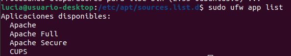
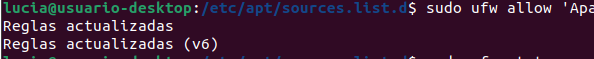

# Introducción

En este documento, explicaré qué es el servidor HTTP Apache y cómo instalarlo correctamente en Ubuntu.

**¿Qué es Apache y para que sirve?**

Apache es un servidor HTTP de código abierto, reconocido como el más popular del mundo. Su función principal es atender las solicitudes de los usuarios que desean consultar una URL, enviando el resultado solicitado de manera eficiente. Ofrece un conjunto de funcionalidades bastante amplio:

1.  Manejo de solicitudes HTTP.
2.  Ofrece soporte para todos los Sistemas Operativos actuales.
3.  Permite la instalación de módulos que amplian sus funcionalidades.
4.  Configuración detallada.
5.  Características que suman seguridad para proteger los sitios web de diversas amenazas.

Apache es fundamental para el funcionamiento de muchos sitios web y aplicaciones en línea, siendo una gran opción para el alojamiento de contenido en la web.

# Relación de las actividades realizadas
La instalación de Apache en Ubuntu se llevará a cabo en el ordenador del aula, este procedimiento forma parte de nuestro trabajo de clase.

Antes de comenzar, es esencial contar con un usuario normal que tenga privilegios de sudo.

## Instalar Apache
_sudo apt update_ -> hay que actualizar los paquetes locales.
_sudo apt install apache2_ -> instalará Apache y todas las dependencias necesarias.

## Ajustar el firewall
Habrá que modificar los ajustes de firewall para permitir el acceso externo a los puertos web predeterminados.
UFW tendría que restringir el acceso al servidor (si has seguido los pasos correctamente), Apache se deberá registrar con UFW y ofrecerá perfiles de aplicación para habilitar o deshabilitar su acceso. Debemos ejecutar lo siguiente:

Debemos habilitar Apache:

