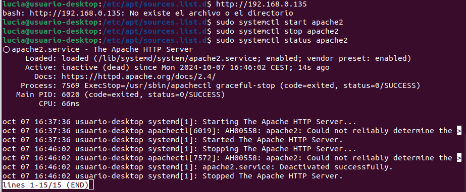

# Introducción

En este documento, explicaré qué es el servidor HTTP Apache y cómo instalarlo correctamente en Ubuntu.

**¿Qué es Apache y para que sirve?**

Apache es un servidor HTTP de código abierto, reconocido como el más popular del mundo. Su función principal es atender las solicitudes de los usuarios que desean consultar una URL, enviando el resultado solicitado de manera eficiente. Ofrece un conjunto de funcionalidades bastante amplio:

1.  Manejo de solicitudes HTTP.
2.  Ofrece soporte para todos los Sistemas Operativos actuales.
3.  Permite la instalación de módulos que amplian sus funcionalidades.
4.  Configuración detallada.
5.  Características que suman seguridad para proteger los sitios web de diversas amenazas.

Apache es fundamental para el funcionamiento de muchos sitios web y aplicaciones en línea, siendo una gran opción para el alojamiento de contenido en la web.

# Relación de las actividades realizadas
La instalación de Apache en Ubuntu se llevará a cabo en el ordenador del aula, este procedimiento forma parte de nuestro trabajo de clase.

Antes de comenzar, es esencial contar con un usuario normal que tenga privilegios de sudo.

## Instalar Apache
_sudo apt update_ -> hay que actualizar los paquetes locales.
_sudo apt install apache2_ -> instalará Apache y todas las dependencias necesarias.

## Ajustar el firewall
Habrá que modificar los ajustes de firewall para permitir el acceso externo a los puertos web predeterminados.
UFW tendría que restringir el acceso al servidor (si has seguido los pasos correctamente), Apache se deberá registrar con UFW y ofrecerá perfiles de aplicación para habilitar o deshabilitar su acceso. Debemos ejecutar lo siguiente:

Debemos habilitar Apache:

Debemos verificar el cambio:

Si el estado aparece como inactivo, deberás activarlo. Una vez que lo actives, el resultado mostrará una lista del tráfico HTTP permitido.Esto indica que el perfil de Apache se activó correctamente para permitir el acceso al servidor web.

## Comprobar su servidor web

Al final del proceso de instalación, Ubuntu inicia Apache. El servidor web ya debería estar activo.
Debemos iniciar el servidor web y realizar una verificación con _systemd_ para saber si está en ejecución el servicio, escribiendo:

La mejor forma de comprobar si se inició correctamente es solicitar una página de Apache. Se puede acceder mediante la dirección IP (si no la sabes, la puedes obtener)

Habrá que introducirla en la barra de direcciones del navegador. Saldrá seguramente la página predeterminada de Apache (si no es así, deberás meterte en una ventana de incognito)

## Administrar el proceso de Apache

Ahora que el servidor web está en funcionamiento, es importante conocer algunos comandos básicos de administración utilizando systemctl. Estos comandos permiten detener, iniciar, reiniciar y recargar Apache sin necesidad de cerrar las conexiones existentes. También puedes habilitar o deshabilitar el inicio automático de Apache al arrancar el servidor.

Con estos comandos, puedes gestionar fácilmente el estado del servidor web Apache y asegurarte de que funcione según tus necesidades.

## Configuración del archivo de configuración virtualHost

Puedes modificar cómo Apache maneja las solicitudes entrantes y alojar múltiples sitios en el mismo servidor editando su archivo de Hosts Virtual.

Para configurar el archivo VirtualHost, primero navega al directorio de archivos de configuración:
_cd /etc/apache2/sites-available/_

Usar el archivo VirtualHost predeterminado como base: _sudo cp 000-default.conf gci.conf_

Luego tenemos que editar el archivo de configuracion: _sudo nano gci.conf_

En ServerAdmin, debemos incluir el correo electrónico en caso de que hayan errores en el servidor Web. 
DocumentRoot para apuntar al directorio donde están alojados los archivos del sitio.
Añade la directiva ServerName para que Apache dirija correctamente las solicitudes al subdominio.

Después de configurar el sitio web, necesitamos activar el archivo de configuración de hosts virtuales para habilitarlo. 
