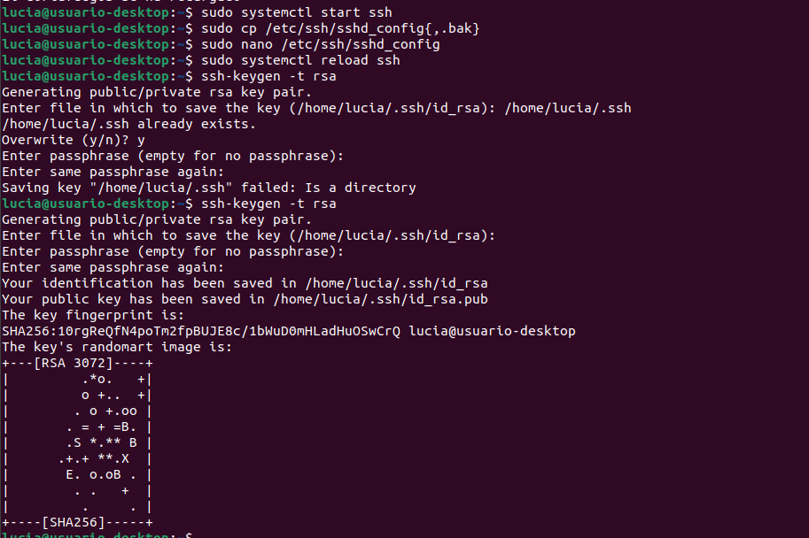
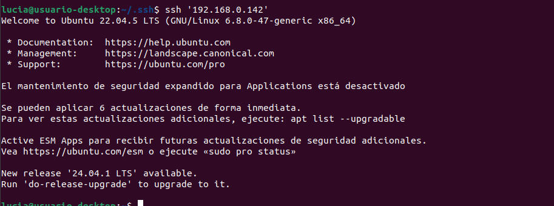
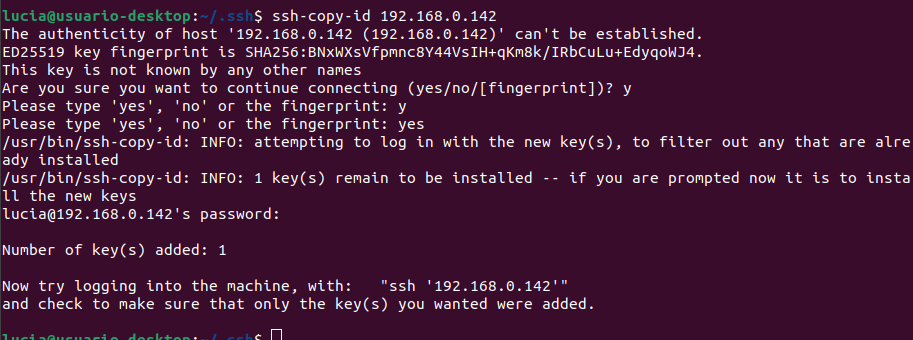
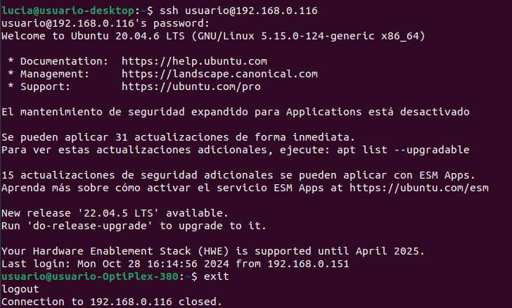
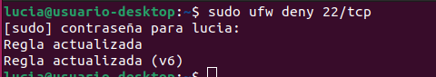
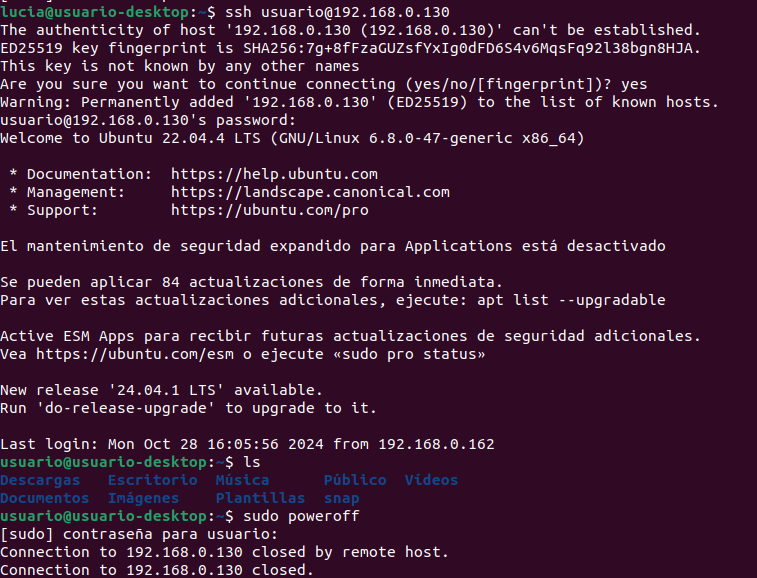

La configuración y uso de SSH para conectarse a un servidor remoto se realizó siguiendo los pasos indicados en el tutorial. Este procedimiento forma parte de nuestro trabajo de clase.

## Instalar SSH en el servidor
Primero, es necesario instalar el servidor SSH en el servidor remoto. En este caso, utilizamos **Ubuntu**.

## Comprobar el estado de SSH
Una vez instalado, se debe verificar que el servicio SSH esté activo.
_sudo systemctl status ssh_

Si el servicio está activo, veremos que el estado indica **active (running)**.

## Configurar el firewall para permitir conexiones SSH
En este paso, debemos asegurarnos de que el firewall permita conexiones a través del puerto 22, que es el puerto por defecto de SSH.

## Crear claves SSH para mayor seguridad
Antes de generar las claves SSH, asegurémonos de que el servicio SSH esté en ejecución en el servidor remoto.
Cuando el servicio SSH esté activo, podemos proceder a generar el par de claves SSH para una autenticación más segura.

El comando generará un par de claves (pública y privada) en el directorio ~/.ssh. La clave pública se transferirá al servidor remoto para habilitar la autenticación sin contraseña, mientras que la clave privada se mantendrá en la máquina local.
Luego, debes verificar que la autenticación por clave funciona correctamente intentando conectarte al servidor remoto.

## Transferir la clave pública al servidor remoto
Para poder conectarse al servidor remoto sin necesidad de ingresar la contraseña cada vez, necesitamos transferir la clave pública al servidor.

Este comando copia la clave pública a la ubicación adecuada en el servidor remoto, permitiendo la autenticación sin contraseña.

## Conectarse al servidor remoto usando SSH
Una vez que la clave se haya copiado correctamente, puedes conectarte al servidor remoto usando SSH.

## Denegar permisos para otros ordenadores
Si deseas denegar el acceso SSH desde cualquier otra dirección IP excepto la que tengas configurada o desde cualquier dispositivo no autorizado, puedes bloquear el puerto 22/tcp.
Este comando bloqueará el acceso al puerto SSH, lo que significa que ningún ordenador podrá conectarse al servidor a través de SSH (excepto el que tenga reglas de firewall configuradas para permitir el acceso).

Te pedirá la contraseña de sudo para confirmar la acción.

Si después de denegar el acceso deseas volver a permitir el acceso a SSH para todos los ordenadores, en vez de **deny** pones **allow**.

## Apagar el servidor de forma remota
Si necesitas apagar o reiniciar el servidor de manera remota, puedes hacerlo utilizando SSH.

