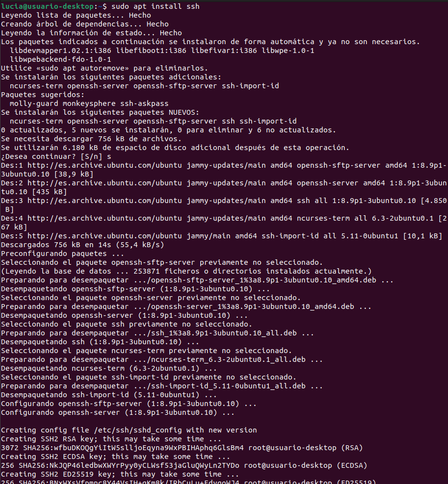
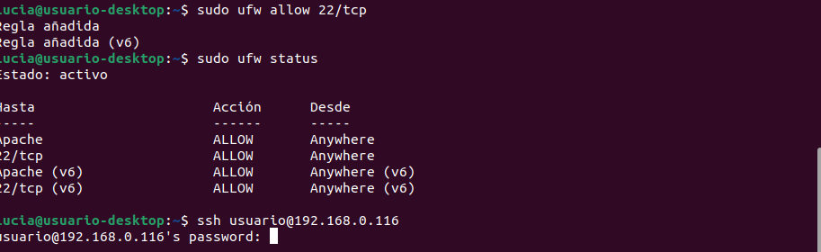

La configuración y uso de SSH para conectarse a un servidor remoto se realizó siguiendo los pasos indicados en el tutorial. Este procedimiento forma parte de nuestro trabajo de clase.

## Instalar SSH en el servidor
Primero, es necesario instalar el servidor SSH en el servidor remoto. En este caso, utilizamos **Ubuntu**.

## Comprobar el estado de SSH
Una vez instalado, se debe verificar que el servicio SSH esté activo.
_sudo systemctl status ssh_

Si el servicio está activo, veremos que el estado indica **active (running)**.

## Configurar el firewall para permitir conexiones SSH
En este paso, debemos asegurarnos de que el firewall permita conexiones a través del puerto 22, que es el puerto por defecto de SSH.

